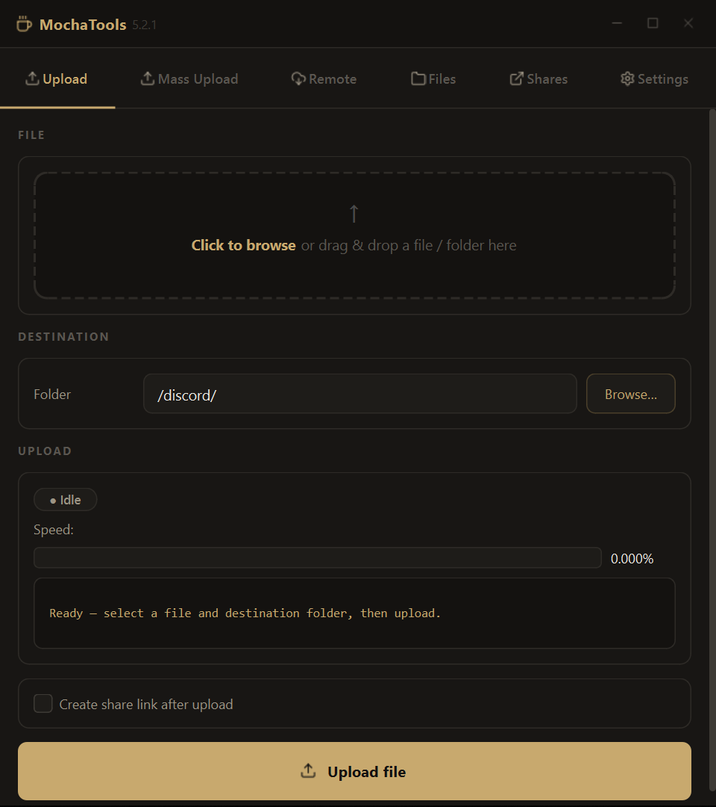
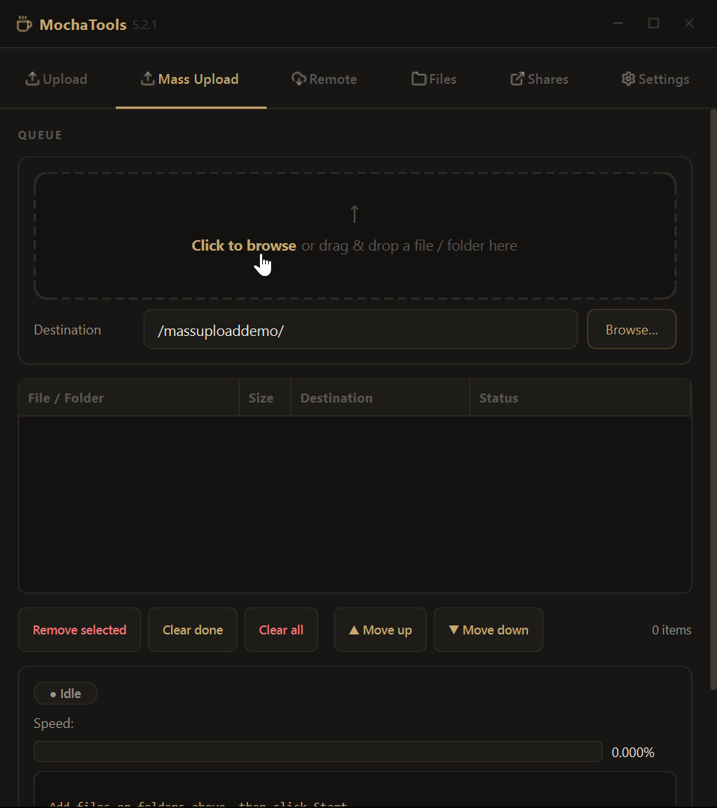
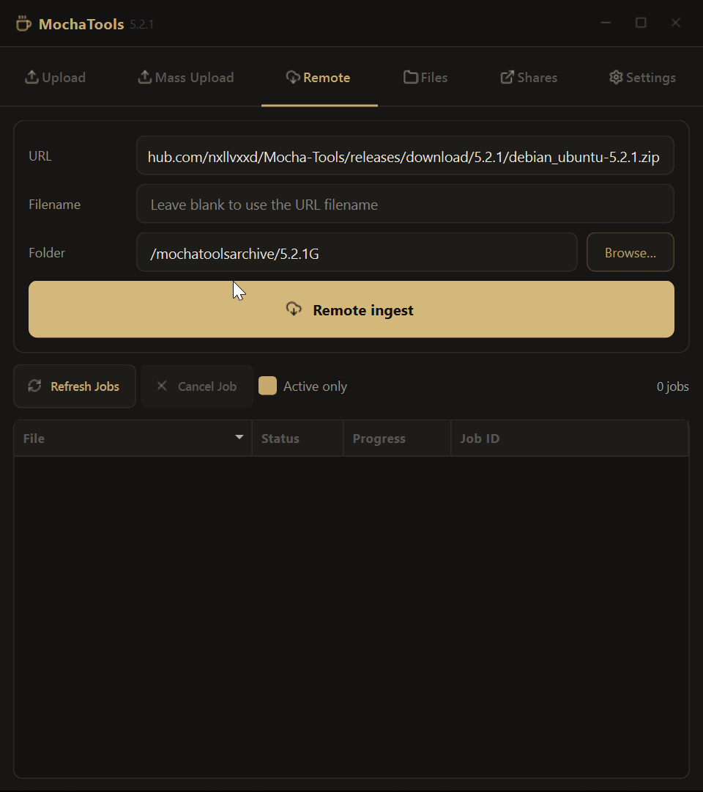
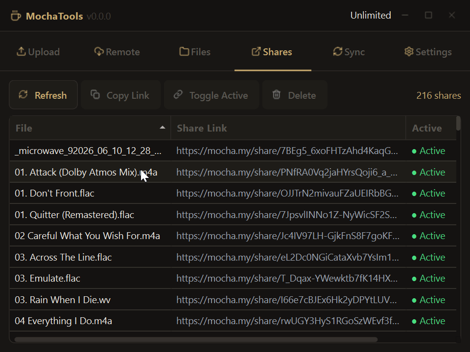
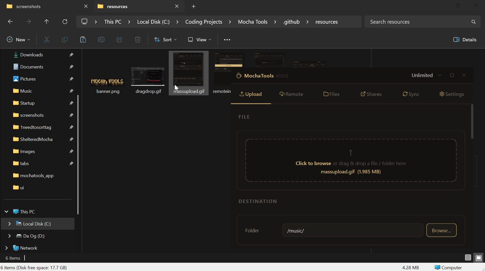

        

  

## Features
- Uploads files to Mocha with a simple drag and drop interface, or selection through file manager.
- Folder upload support
- Upload speed and progress indicators
- Create share links with all options from within the program
- Ability to view files and folders
- Togglable debug mode for easier troubleshooting
- Share management, including viewing shares, toggling active or inactive, and deleting shares
- Remote ingest support
- Upload multiple files and folders at once with mass upload.
- Preview various filetypes in your storage from text to video and audio:
    - Video: .mp4, .mov, .avi, .mkv, .wmv, .flv, .webm, .m4v, .mpeg, .mpg, .3gp
    - Audio: .mp3, .flac, .m4a, .wav, .ogg, .aac, .wma, .opus, .aiff, .aif
    - Images: .jpg, .jpeg, .png, .gif, .bmp, .webp, .ico, .tiff, .tif, .svg
    - Text: .txt, .md, .markdown, .rst, .log, .csv, .tsv, .py, .pyw, .js, .mjs, .cjs, .ts, .tsx, .jsx, .html, .htm, .css, .scss, .sass, .less, .json, .jsonc, .xml, .yaml, .yml, .toml, .ini, .cfg, .c, .h, .cpp, .hpp, .cc, .cs, .java, .kt, .swift, .go, .rs, .rb, .php, .lua, .sh, .bash, .zsh, .ps1, .sql, .env, .gitignore, .gitattributes, .dockerfile, .vue, .svelte, .graphql, .proto, .bat, .r, .pl
- Sync folders between Mocha and your local PC without having to manually trigger uploads, just watch the folder and let Tools do the work for you
- Enable or disable the tray icon in settings to keep Tools open without taking up taskbar space

## HUGE THANKS TO [BINK-LAB](https://github.com/Bink-lab) FOR MOCHA, ACCESS TO IT AND THE API, AS WELL AS CONTRIBUTIONS
## Source Requirements
- Python 3.11 **ONLY** (can be downloaded [here](https://www.python.org/downloads/))
- PyQt6
- requests
- pyinstaller
- Packaging
- Keyring
- mutagen
- python-ffmpeg
- A Mocha account and an API key which can be obtained [here](https://mocha.my)

### Running From Source
1. `git clone https://github.com/nxllvxxd/Mocha-Tools`
2. `cd Mocha-Tools`
3. `pip install -r requirements.txt`
4. `py -3.11 mochatools.py`

## Preview

 
  

 
  
  

  

## Potential? Ideas
| Idea | Complete? |
| :---- | :----: |
| Merge mass upload, and upload | ✅ |
| Add custom colors support | ✅ |
| Add custom font support | ✅ |
| Add folder sync support | ✅ |
| Add support for file previews (images, video, audio) | ✅ |
| Add download support for your own files | ✅ |
| Create android version | ❌ |
| Add to context menu (traditiional and Windows 11 (maybe idk how that works yet) for easy uploading | ❌ |
| Complete control over files, deletion, moving, sharing, etc. | ✅ |
| Debug and token management in its own tab | ✅ |
| Add support for multiple files and folders at once | ✅ |
| Configurable upload settings, such as chunk size and number of threads | ✅ |

|**ISSUES**|
| :---- |
|<ul><li>~~Folder rename not functioning~~</li><li>Updating is broken on ~~Windows~~, ~~Ubuntu~~, Mac</li><li>~~MacOS build seems to not be functioning according to reports~~</li><li>~~Need to make the options tab appear more consistent~~</li><li>~~Deleting multiple shares does not work~~</li><li>~~Progress bar glitches after canceling upload~~</li><li>~~Under 50mb files are kinda buggy and drop resulting in EOF issues~~</li><li>~~100GB files not functioning (might be misreport will look into)~~ (seems to be fixed unsure)</li><li>~~Selecting move folder doesn't select folder if inside~~</li><li>~~Upload speed and percent is buggy (especially on large files)~~</li><li>~~Unable to toggle share as active or inactive~~</li><li>~~Share link creation creates share but provides incorrect link~~</li><li>~~Folder upload just dumps all files in root without creating new folder~~</li><li>~~Original file names not being listed~~ Thank you [Bink-lab](https://github.com/Bink-lab)</li><li>~~Unable to move files~~</li><li>~~Unable to ~~create~~ or view shares~~</li><li>~~Large file upload is not working correctly~~ Thank you [Bink-lab](https://github.com/Bink-lab)</li><li>~~Uploading to specific existing folders is not functioning~~</li><li>~~Moving files or folders deeper than one folder does not function~~</li><li>~~Uploading deeper than one folder is not working~~</li></ul>|